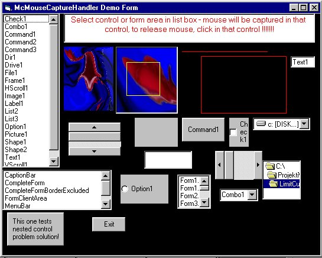



## McMouseCaptureIntoAnyArea ver\. 2\.0

### Description

I extended this thing, so I should be able to

get more than one vote now.

ver 1: capture mouse to any rect area defined

by any vb rect control(including shape,image..)

ver 2. capture mouse to following:"CaptionBar"

or "FormClientArea" or "CompleteForm" or

"CompleteFormBorderExcluded"

All detailed explained in module. Exe that

shows things included ( code too ofcourse)
 
### More Info
 

             |
---                |---
**Submitted On**   |1998-08-11 15:51:24
**By**             |[M\.C](https://github.com/Planet-Source-Code/PSCIndex/blob/master/ByAuthor/m-c.md)
**Level**          |Advanced
**User Rating**    |4.0 (20 globes from 5 users)
**Compatibility**  |VB 6\.0
**Category**       |[Miscellaneous](https://github.com/Planet-Source-Code/PSCIndex/blob/master/ByCategory/miscellaneous__1-1.md)
**World**          |[Visual Basic](https://github.com/Planet-Source-Code/PSCIndex/blob/master/ByWorld/visual-basic.md)
**Archive File**   |[CODE\_UPLOAD8728882000\.zip](https://github.com/Planet-Source-Code/m-c-mcmousecaptureintoanyarea-ver-2-0__1-10506/archive/master.zip)

